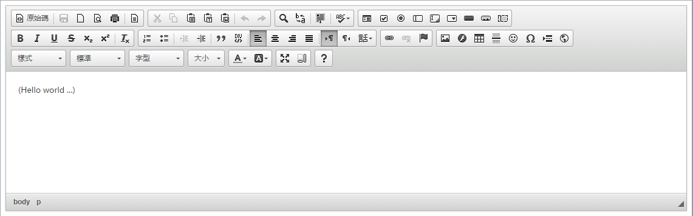

# CKEditor

<script type="text/javascript" src="gitbook/app.js"></script>
<script type="text/javascript" src="js/general.js"></script>

###開始使用
---
* 首先至官網 [CKEditor Official Download Website](http://ckeditor.com/download) 下載需要的版本，開原版本分成 Basic Package, Standard Package 與 Full Package；一般而言，常用的網頁編輯採用 Standard Package 即可，而若是需要如數學公式撰寫需求，才需要使用 Full Package。

| 註解 |
| -- |
| 底下範例以 Full Package 為例。而使用的版本為 4.5.8。 |

* 解壓縮資料夾，並將整個資料夾 (資料夾名稱 ckeditor) 複製到開發 html 專案的資料夾下。

* 在開發的 html 文件中引用 ckeditor javascript package，如下；

```Html
<script type="text/javascript" src="ckeditor/ckeditor.js"></script>
```

| 註解 |
| -- |
| 要注意需先引用 jquery library。 |

* 引用 .js package 後，於 html 文件中定義要使用 ckeditor 的物件，一般而言是以 textarea 為主，如下；

```Html
<textarea name="editorZone" id="editorZone" rows="20" cols="80">
	(Hello world ...)
</textarea>
```

並配合下列 javascript code 來告訴 ckeditor 要控制的物件。

```Html
<script type="text/javascript">
	CKEDITOR.replace( 'editorZone' );
</script>
```

其中 textarea 中 id 名稱定義主要被 jquery 使用，而相較於 name ，則是可以搭配 form submit 使用來，而 row 與 column 分別定義 textarea 的編輯區域有多少列與多少欄。若是透過瀏覽器查看該頁面，如下畫面；



如此便可視成初步建置完成。

###搭配 form submit 及取得編輯內容的原始碼
---
大部分使用此類 jQuery 編輯器，多半是需要提供使用者客製化編輯網頁的能力，因此取得編輯內容是一件很重要的事，而我們可以搭配 form submit 方式來達成取出編輯內容，如下 (以 PHP Script 為例)；

```Html
<script type="text/javascript" src="jquery-1.12.2.min.js"></script>
<script type="text/javascript" src="ckeditor/ckeditor.js"></script>

<!-- 透過 form 方式，當使用者 submit 之後，便會將此 textarea 內容以 post 方式傳送 -->
<form name="getContent" id="getContent" method="post" action="#"> 
	<div id="editSection">
	<textarea name="editorZone" id="editorZone" rows="20" cols="80">
		(Hello world ...)
	</textarea>
	</div>
	<div><input type="submit" value="submit" id="sendInfo"></input></div>
</form>

<script type="text/javascript">
	CKEDITOR.replace( 'editorZone' );
</script>
```

但若是透過此方法傳送資料，則傳送的資料會是以 text 方式 (** 即僅有文字內容，不包含編輯的樣式，如顏色、文字大小等 **)，因此需要透過 ckeditor package 內定義的 instance 方式來取得 html code，如透過下方程式碼來取得編輯內容的完整 html code；

```Javascript
// 需要注意此 instances 需指向要給使用者編輯物件的 id 名稱
CKEDITOR.instances['editorZone'].getData();
```

而可能出現的結果如下；

```Bash
"<p><u><em><span style="font-size:20px"><strong><span style="color:#FF0000">(Hello world ...)</span></strong></span></em></u></p>"
```

進一步可以在點擊 submit 按鈕後，動態創建一個 textarea 將 value 設定為取出的完整 html code，如此一來便可以隨著 form submit 後便將完整的 html code 以 POST 方式傳送出去，如下；

```Html
<script type="text/javascript">
	CKEDITOR.replace( 'editorZone' );
	
	$("#sendInfo").click(function() {
		// control method selected
		$("#editSection").append('<div><textarea name="editorZoneDetail" id="editorZoneDetail" value="' + CKEDITOR.instances['editorZone'].getData() + '" style="position: absolute; left: -9999px"></textarea></div>');
	});
</script>
```

當點擊 submit 後，便會動態產生一個名與 id 皆為 editorZoneDetail 的 textarea 物件，而其 value 為該編輯器內容的完整 html code ，然後以 post 方式傳送出去。


