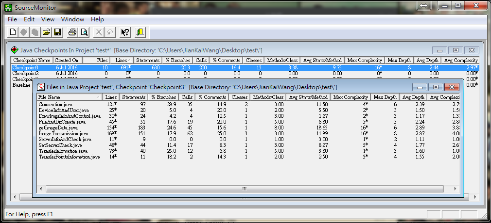

# SourceMonitor : 程式碼複雜度分析工具

* SourceMonitor 是一套分析程式碼複雜度的工具，以量化的數據呈現哪些程式碼過於複雜，並以此當作 Code Review 中程式碼品質要求、重構的依據，促使開發者避免撰寫複雜度過高或深度太高的程式碼，以增加程式碼可讀性及減少 trace code 的時間。

* 特色：
  1. 支援 C++, C, C#, VB.NET, Java, Delphi, Visual Basic (VB6) or HTML。
  2. 僅支援 Windows 開發環境。

###安裝與使用 SourceMonitor
* 安裝與環境設定
  1. 於[官網](http://www.campwoodsw.com/sourcemonitor.html)中下載 .exe 檔案進行安裝
  2. 因大部分的開發環境為 UTF-8 編碼，於 「File」的「Options」中，勾選「Allow parsing of UTF-8 files」。

* 分析流程
  1. 自「File」的「Project」開始
  2. 選擇要掃描的語言與排除的檔案類型
  3. 輸入專案名稱與專案檔案放置位置
  4. 輸入要掃描檔案的位置 (Select Source Files By Extension)
  5. 選擇細部掃描設定 : 包含使用複雜的矩陣來紀錄，是否艘苗 header 或 footer 註解內容等。
  6. 選擇將掃描結果輸出成新的或舊的 SourceMonitor 格式。
  7. 輸入檢查點名稱 (SourceMonitor 將複合矩陣存入 checkpoint 中紀錄)

###檢視分析結果
---

* 檢視每次 checkpoint 結果 (可以點擊每一次檢查的結果)

  1. 其中以 Complexity 與 Depth 為主要觀察數值。

* 檢視該次 chekcpoint 的總結 (點擊每一個檔案便可以進行歸納)

