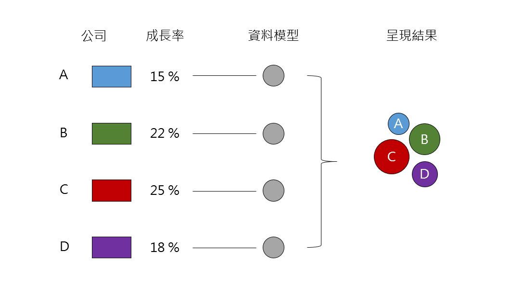

# D3.js

D3 (Data-Driven Documents) 是一套 Javascript 函式庫能夠依照資料本身來修飾要用來呈現的物件。D3.js 基礎是建立在資料與物件的結合，示意圖如下；



顏色代表不同公司，數值代表該公司的經濟成長率，在套用資料模型為園圈之下，則透過 d3 將資料內容傳入資料模型，可以得出右側的呈現結果。<br>
**因此 D3 允許將隨意的資料與文件中的物件模型  (DOM, Document Object Model) 進行繫結，即資料驅使化的物件變形。**舉例而言，透過 D3 可以將一串列中的資料轉型成 html table。<br>
底下介紹數種 D3.js 的特性，包含 
1. selection, 
2. dynamic properties, 
3. enter and exit,
4. transformation, not representation,
5. transition

###Selection
---
D3 透過宣告式語法，改良原本透過 W3C DOM API 操作 HTML 文件中物件的方法，可以透過 (1) 組合式，或是 (2) 階層式 等方式來操作 HTML 文件中的物件 (或稱為 node)。

* 直接透過 W3C DOM API 方式來操作 HTML 文件中的物件方法，如下例將 HTML 文件所有 tag 為 p 的物件中的文字顏色改為藍色。

```Javascript
var paragraphs = document.getElementsByTagName("p");
for (var i = 0; i < paragraphs.length; i++) {
  var paragraph = paragraphs.item(i);
  paragraph.style.setProperty("color", "blue", null);
}
```

* 改用 D3 方式來完成將 HTML 文件所有 tag 為 p 的物件中文字顏色改為藍色，如下；

```Javascript
d3.selectAll("p").style("color", "blue");
```

此作法與透過 jQuery 取得全部 &lt;p&gt; 物件後，再進行顏色設置的結果相同，如下；

```Javascript
for(var i = 0 ; i < $("p").length ; i++) { 
  $($("p")[i]).css({ "color": "blue" }); 
}
```

在 D3 中，選取 html 文件中的物件 (node 或是 elements) 可以透過很多種方式來達成，如 containment, attribute values, class 或是 ID 等。

###Dynamic Properties
---
D3 與 jQuery 在物件操作上相當類似，能夠在某些條件成立下給與物件不一樣的樣式 (如 CSS Style)、物件屬性 (Attribute) 或其他特性 (Property) 等。意即可以透過函式 (function) 來動態改變物件樣式或特性，而非使用純粹的常數 (constant)，如透過下列程式碼將 html 文件中 p 物件的文字顏色隨機指定；

```Javascript
d3.selectAll("p").style("color", function() {
  return "hsl(" + Math.random() * 360 + ",100%,50%)";
});
```

而上列程式碼可以大大改善 W3C DOM API 對物件的操作，此類似直接透過 jQuery 來進行物件操作，如下；

```Javascript
$($("p")[0]).css({ 
  'color' : function() { return 'red'; } 
});
```

而另外亦有許多內建的函式能增強 jQuery 對物件的操作，如 **d3.geo.path** 能投影地裡座標投影到 SVG 路徑資料。其他另有內建函式庫能將原始地理資料轉成區域、線性與圖表。<br>
對於相同選擇類型但不同物件的操作，更可以直接透過簡易的函式來操作，如下列程式碼能將相同為 p tag 的物件中，偶數個物件與奇數個物件的文字顏色進行變化；

```Javascript
// 其中 d 表示傳入函式的物件序列
// i 則表示此屬性的值
d3.selectAll("p").style("color", function(d, i) {
  return i % 2 ? "#fff" : "#eee";
});
```

在 D3.js 中也提供 binding data 的功能，可以預先將資料準備，並透過傳入相同類型但不同物建序列的方式，依序將先前 binding 的資料帶入而達成動態特性，如下列程式碼；

```Javascript
d3.selectAll("p")
    .data([4, 8, 15, 16, 23, 42])
    .style("font-size", function(d) { return d + "px"; });
```

上述程式碼說明如下；
* 取得所有 tag 為 p 類型的物件，以 List 方式儲存
* 將先前 binding data 依序帶入物件中， data 一樣為 List 型態

###Enter & Exit
---


