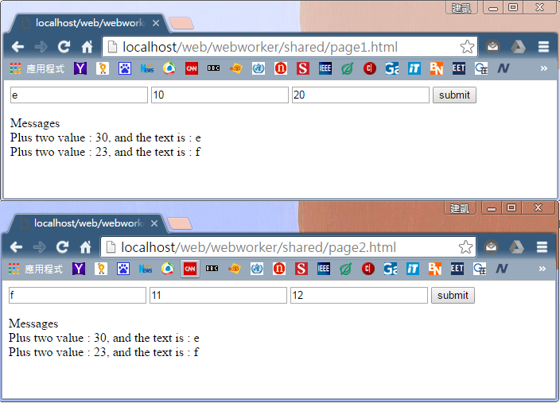

# shared worker

shared worker 能夠被多個程式腳本存取，包含 window、iframe 或其他 worker 執行緒，底下範例實作兩種狀況；
1. 當其中一個前端頁面傳入參數值給 shared worker 並經過其執行後，會將計算後的値同步傳回給 **所有** 註冊 (透過 port 的形式) 於該 shared worker 的前端頁面。
2. 當第一個前端頁面創造一個 shared worker，此 worker 便會自行計算與執行，其他前端頁面便可以直接取得已計算的結果，不需重新計算或傳入參數。(** 第一個前端頁面不需要傳入參數 **)


| 註解 |
| -- |
| 需要注意底下幾點；<br>(1) 範例中含有兩份 HTML 頁面，各自都利用** 同一個 worker **處理運算<br>(2) shared worker 無法在一般瀏覽模式與隱私流覽模式間共享資料。 |

###產生 shared worker 物件
---
和 dedicated worker 相同，不同的是透過不同的建構子來達成，如下；

```Javascript
var myWorker = new SharedWorker("worker.js");
```

**但 shared worker 的運作模式與 dedicated worker 有很大的不同，與 shared worker 的溝通須透過 port 物件來達成。** 其實 dedicated worker 的運作方式亦雷同，只是自動完成而已。
而開啟 port 的方法有底下兩種；

1. 可以透過 onmessage 方式在背景自動開啟 port 連線
2. 主動呼叫 start() 來傳送訊息，但若要主動式傳送訊息，則需在前端頁面與 shared worker 分別啟動 port，如下；

| 於主頁面主動呼叫 start() 來傳送訊息 |
| -- |
| ```myWorker.port.start(); // 前端頁面使用``` |

| 於 shared worker 中呼叫 start() 來傳送訊息 |
| -- |
| ```port.start(); // shared worker 中使用 (port 為資料型態為 port 的變數名稱)``` |

###和 shared worker 傳送訊息
---

* 傳送訊息給 shared worker : 和 dedicated worker 相同可以透過 postMessage() 來達成，但在 shared worker 中需要透過 port 物件來達成，如下範例；

```Javascript
myWorker.port.postMessage([value.1, value.2]);
console.log('Message posted to worker');
```

* 而在 shared worker 方面，則是透過 ** onconnect() ** 進行監聽，然後透過 ** onmessage() ** 接收來自前端的資料，並利用 ** postMessage ** 將資料回傳給前端頁面，如下範例；

```Javascript
onconnect = function(e) {
    // e.ports[0] 表示現在傳入參數值的前端頁面
    // 因為傳入 shared worker 的前端頁面可能不只一個，因此傳入的 port 是以 list 方式表示
	var port = e.ports[0];
    
	port.onmessage = function(e) {
		var workerResult = 'Result: ' + (e.data[0] * e.data[1]);
		port.postMessage(workerResult);
	}
    
    // 若是透過 onmessage 方式來傳送資料，則不需要透過 .start() 方式來開啟
	port.start(); 
}
```

* 而最後，在前端頁面，一樣是透過 port 物件中的 onmessage() 方式來取得 shared worker 的回傳結果，範例如下；

```Javascript
myWorker.port.onmessage = function(e) {
  console.log('Message received from worker is : ' + e.data);
}
```

###實作範例 1
---
情境如下；

「當其中一個前端頁面傳入參數值給 shared worker 並經過其執行後，會將計算後的値同步傳回給 **所有** 註冊 (透過 port 的形式) 於該 shared worker 的前端頁面。」

內容包含下列頁面，其中 page1.html 與 page2.html 的內容相同；

1. page1.html : 前端頁面 1
2. page2.html : 前端頁面 2
3. sworker.js : shared worker 主體

page1.html 與 page2.html 的內容如下；

```Html
<form id="form">
	<input type="text" id="topic" placeholder="word"></input>
	<input type="text" id="value1" placeholder="numeric"></input>
	<input type="text" id="value2" placeholder="numeric"></input>
	<input type="submit" value="submit"></input>
</form>
<div>Messages<div id="listPanel"></div>

<script>
// shared worker 預設傳入兩個參數，包含 shared worker 的檔案，與該 shared worker 的名稱
var shared = new SharedWorker('sworker.js', 'math');
var form = document.getElementById('form');
form.onsubmit = function(e) {
	e.preventDefault();
	
	var topic = document.getElementById('topic').value;
	var val1 = document.getElementById('value1').value;
	var val2 = document.getElementById('value2').value;
	
	// send the shared worker values
	shared.port.postMessage([topic,val1,val2]);
	
    // 避免 form submit 後的重導頁面
	return false;
}
shared.port.onmessage = function(e) {
	document.getElementById('listPanel').innerHTML += e.data + '<br>';
}
</script>
```

shared worker 內容如下，將由前端頁面傳入參數的値透過 shared worker 執行後，回傳給所有已註冊的前端頁面；

```Javascript
// save all already existing ports
var ports = [];

onconnect = function(e) {
if(e.ports && e.ports.length > 0) {
	e.ports[0].onmessage = function(e) {
		for(var m = 0; m < ports.length ; m++) {
			ports[m].postMessage("Plus two value : " + (parseInt(e.data[1]) + parseInt(e.data[2])) + ", and the text is : " + e.data[0]);
		}
	}
	ports.push(e.ports[0]);
}
};
```

而執行後的結果如下；



當 page1.html 或 page2.html 進行更新時，另一頁面亦會自動更新內容。

###實作範例 2
---
情境如下；

「當第一個前端頁面創造一個 shared worker，此 worker 便會自行計算與執行，其他前端頁面便可以直接取得已計算的結果，不需重新計算或傳入參數。」

內容包含下列頁面，其中 page1.html 與 page2.html 的內容相同；

1. page1.html : 前端頁面 1
2. page2.html : 前端頁面 2
3. sworker.js : shared worker 主體

page1.html 與 page2.html 的內容如下；

```Html
<div>Messages<div id="listPanel"></div>

<script>
var shared = new SharedWorker('sworker.js', 'math');

// 不傳入任何資料給 shared worker
shared.port.postMessage([]);
shared.port.onmessage = function(e) {
	document.getElementById('listPanel').innerHTML += e.data + '<br>';
}
</script>
```

shared worker 的內容如下；

```Javascript
var getData = "getData information";

onconnect = function(e) {
if(e.ports && e.ports.length>0) {
    // 取得現在傳入參數的前端頁面 port
	var selfPort = e.ports[0];
    
	selfPort.onmessage = function() {
        // 直接回傳已經處理完的結果
		selfPort.postMessage(getData);
	}
}
};
```


