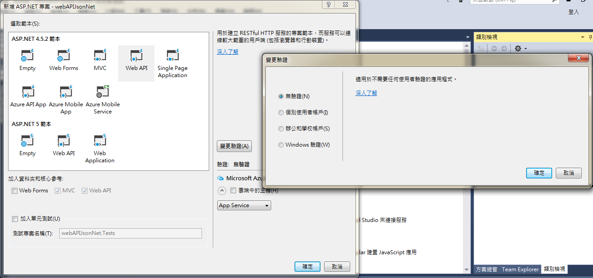

# MVC 透過 JSON.NET 創建 Web API

<script type="text/javascript" src="gitbook/app.js"></script>
<script type="text/javascript" src="js/general.js"></script>

Restful API 為目前主流的資料傳輸方式之一，其 JSON 資料格式更有許多標準函式庫能直接進行處理。底下透過 MVC 設計方式，例用 JSON.NET 方式創建一個實作 GET 的 Web API。

###開發環境
---
* Visual Studio 2015 Community
* ASP.NET 4.5.2

###開始一個 VS 專案
---
由「檔案」 > 「新增」 > 「專案」 > 選擇 Visual C-sharp 「Web」 > 「ASP.NET Web 應用程式」 > 選擇 「Web API」 > 右側「變更驗證」 > 「無驗證」



開啟後，可以直接點擊瀏覽器來執行，此時會出現下列畫面，其網址為 ** http://localhost:9000 **


###創建一個 Controller
---

於 Controllers 資料夾加入一個新的 Web API 2 的 controller ，此控制器名稱為「jsonnetController」。 可以選擇「具有讀取/寫入動作的 Web API 2 控制器」。如此一來會將 CRUD 的操作預先產生，如下；

```C#
namespace WebAPIJsonNETTemplate.Controllers
{
    public class ValuesController : ApiController
    {
        // GET api/values
        public IEnumerable<string> Get()
        {
            return new string[] { "value1", "value2" };
        }

        // GET api/values/5
        public string Get(int id)
        {
            return "value";
        }

        // POST api/values
        public void Post([FromBody]string value)
        {
        }

        // PUT api/values/5
        public void Put(int id, [FromBody]string value)
        {
        }

        // DELETE api/values/5
        public void Delete(int id)
        {
        }
    }
}
```

###連接資料庫並將資料用 JSON.NET 準備
---

假設資料庫名稱為 employees，要讀取的資料表為 employees，內容如下；

| id | emp_no | birth_date | first_name | last_name | gender | hire_date |
| -- | -- | -- | -- | -- | -- | -- |
| 1 | 10001 | 1953-09-02 | Geo | Fac | M | 1986-06-26 |
| 2 | 10002 | 1964-06-02 | Bez | Sim | F | 1985-11-21 |

可以簡單透過下列 sql 指令來取得依 emp_no 遞升後的前 10 筆資料；

```Sql
select top 10 * from dbo.employees order by emp_no asc;
```

於 jsonnetController.cs 中加入實作連接資料庫、取得資料並將之透過 JSON.NET 轉成 json string 的函式，如下；

```C#
// must using libraries
using Newtonsoft.Json;
using System.Data;
using System.Data.SqlClient;


```


