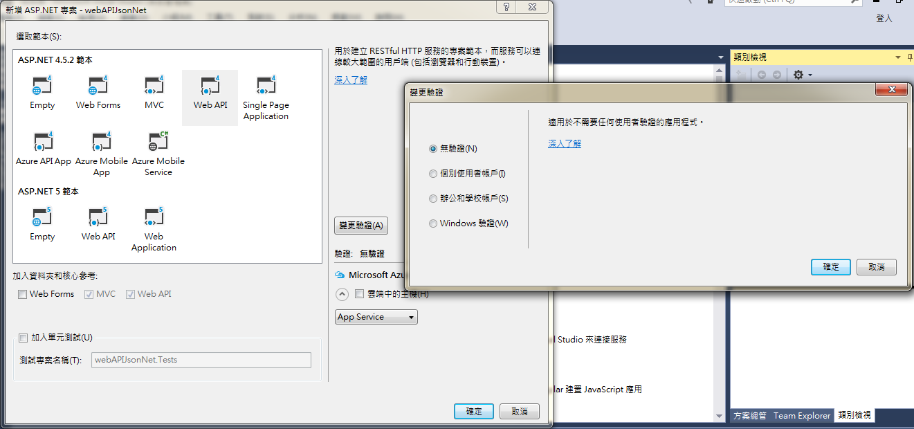
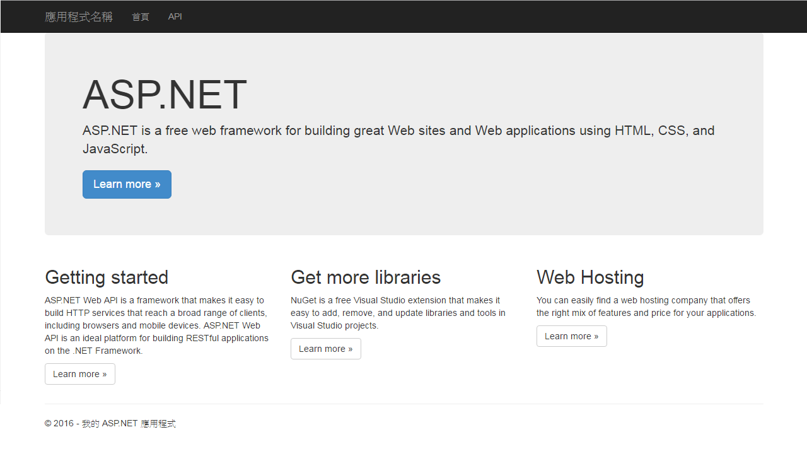

# MVC-based Web API

<script type="text/javascript" src="gitbook/app.js"></script>
<script type="text/javascript" src="js/general.js"></script>

Restful API 為目前主流的資料傳輸方式之一，其 JSON 資料格式更有許多標準函式庫能直接進行處理。底下透過 MVC 設計方式，創建一個 Web API。

###開發環境
---
* Visual Studio 2015 Community
* ASP.NET 4.5.2

###開始一個 VS 專案
---
由「檔案」 > 「新增」 > 「專案」 > 選擇 Visual C-sharp 「Web」 > 「ASP.NET Web 應用程式」 > 選擇 「Web API」 > 右側「變更驗證」 > 「無驗證」



開啟後，可以直接點擊瀏覽器來執行，此時會出現下列畫面，其網址為 ** http://localhost:9000 **



此時若是將網址改成 ** http://localhost:9000/api/values **，於 「** chrome **」中會出現下列 XML 內容；

```Xml
This XML file does not appear to have any style information associated with it. The document tree is shown below.
<ArrayOfstring xmlns:i="http://www.w3.org/2001/XMLSchema-instance" xmlns="http://schemas.microsoft.com/2003/10/Serialization/Arrays">
  <string>value1</string>
  <string>value2</string>
</ArrayOfstring>
```

但若是使用 「** Internet Explorer **」則會以下載的方式出現 「** values.json **」，其內容為 json 格式，並以 list 方式出現，如下；

```Javascript
["value1","value2"]
```

###初探 Web API
---
若是打開方案總管中的 ** Global.aspx **，會看到下方的內容；

```C#
// ...

namespace webapiJsonNet
{
    public class WebApiApplication : System.Web.HttpApplication
    {
        protected void Application_Start()
        {
            AreaRegistration.RegisterAllAreas();
            
            // 註冊 Web API 的路由器內容，名為 WebApiConfig
            GlobalConfiguration.Configure(WebApiConfig.Register);
            
            FilterConfig.RegisterGlobalFilters(GlobalFilters.Filters);
            RouteConfig.RegisterRoutes(RouteTable.Routes);
            BundleConfig.RegisterBundles(BundleTable.Bundles);
        }
    }
}
```

其中一段 GlobalConfiguration 說明了 Web API 路由設定，接著打開 ** App_Start ** 資料夾中的 ** WebApiConfig.cs **，則會出現下列程式碼；

```C#
// ...

namespace webapiJsonNet
{
    public static class WebApiConfig
    {
        public static void Register(HttpConfiguration config)
        {
            // Web API 設定和服務

            // Web API 路由
            config.MapHttpAttributeRoutes();

            config.Routes.MapHttpRoute(
                name: "DefaultApi",
                routeTemplate: "api/{controller}/{id}",
                defaults: new { id = RouteParameter.Optional }
            );
        }
    }
}
```

* 可以看見位於 App_Start 資料夾中的 WebApiConfig.cs 定義了 Web API 的路由器
* 其中一函式 **  config.Routes.MapHttpRoute() **說明了路由位址，即網路位址的 URL
* 其中 ** name ** 為路由器名稱 (不能重複)
* ** routeTemplate ** 為路由位址，與取得參數值的方式
* ** defaults ** 則是定義取得參數的方法或該設定

因此若打開 ** Controllers ** 資料夾中，會發現有 ** ValuesController.cs ** 的類別，此類別名稱 (Values，即是控制器的名稱)，便是在 ** WebApiConfig.cs ** 中路由器所定義 routeTemplate 的 controller 名稱，因此於網頁中便可以透過 http://localhost:9000/api/Values 來存取 api，而其內容便定義下列各項 CRUD 的操作方式；

```C#
// ...

namespace webapiJsonNet.Controllers
{
    public class ValuesController : ApiController
    {
        // GET api/values
        public IEnumerable<string> Get()
        {
            return new string[] { "value1", "value2" };
        }

        // GET api/values/5
        public string Get(int id)
        {
            return "value";
        }

        // POST api/values
        public void Post([FromBody]string value)
        {
        }

        // PUT api/values/5
        public void Put(int id, [FromBody]string value)
        {
        }

        // DELETE api/values/5
        public void Delete(int id)
        {
        }
    }
}
```

而函式 Create, Read, Update 及 Delete 便是相對應為 Post(), GET(), Put() 與 Delete() 函式，此便是可以透過 $.ajax 與。而因為網頁預設為 GET() 內容，因此當以網頁瀏覽 http://localhost:9000/api/Values 時，會直接呼叫 GET() 函式。**其中函式 GET() 被重載，因此能夠依不同的參數值而有不同的處理。**當以網頁瀏覽 http://localhost:9000/api/Values/1 時，因為有傳入 id (在 WebApiConfig.cs 中被定義為 RouteParameter.Optional)，因此會回傳 Get(int id) 執行後的結果 (即 "value")。**因為 MVC 架構下，Controller 會直接將結果傳給 View 進行呈現，因此 Controller 直接透過 return 被視為將資料傳送至前端。**

###Controller 處理回傳給 View 的物件
---


###設定回傳的資料格式
---


