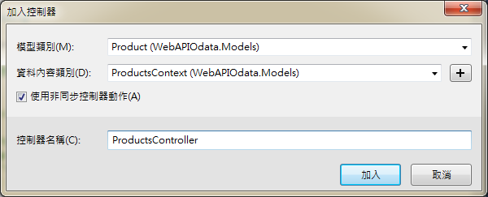

# OData
###採用架構
---
* C#
* ASP.NET 4.5.2
* Web API 2.2
* MVC 5
* OData v4.0
* Web.Odata
* Entity Framework 6
  * Entity Framework (又稱ADO.NET Entity Framework) 是微軟以 ADO.NET 為基礎所發展出來的物件關聯對應 (O/R Mapping) 解決方案，早期被稱為 ObjectSpace，現已經包含在 Visual Studio 2008 Service Pack 1 以及 .NET Framework 3.5 Service Pack 1 以上發表。
  * ADO.NET Entity Framework 以 Entity Data Model (EDM) 為主，將資料邏輯層切分為三塊，分別為 Conceptual Schema, Mapping Schema 與 Storage Schema 三層，其上還有 Entity Client，Object Context 以及 LINQ 可以使用。
  * LINQ (Language Integrated Query)，是一項微軟技術，新增一種自然查詢的 SQL 語法到.NET Framework的程式語言中。
* OData.Edm 6.14.0 (至少 6.5.0 版本以上)

###常用指令
---
| 指令 | 說明 | 範例 |
| -- | -- | -- |
| top | 挑出最前面的幾筆 | 	?$top=3 |
| skip |略過幾筆。可用於分頁顯示 | ?$skip=10 |
| orderby | 排序 | ?$orderby=SupplierID,ProductID |
| filter | 篩選 |  |
|  | gt : > , 大於 | $filter=ProductID gt 10 |
|  | lt : < , 小於 | $filter=ProductID lt 10 |
|  | ge : >=, 大於等於 | $filter=ProductID ge 10 |
|  | le : <=, 小於等於 | $filter=ProductID le 10 |
|  | eq : =, 等於 | $filter=ProductID eq 10<br>$filter=name eq 'f' |
|  | ne : <>, 不等於 | $filter=ProductID ne 10 |

###實作範例
---
#####透過 Web API MVC 連結資料庫中的資料表並實作出 OData RESTful Json 格式介面。

###開始一個 VS 專案
---
* 檔案 > 新增 > 專案 > 範本 > Visual C# > Web > ASP.NET Web 應用程式
* 可以選擇是否採用 MVC 架構 : 本次採用 Web API 範本為例
  * Web API (已加入 MVC 及 Web API 核心參考) > 變更驗證 > 無驗證
  * Empty (至少需勾選 Web API 核心參考)


###安裝所需 Packages
---
* 路徑 : 工具 > NuGet 封裝管理員 > 套件管理器主控台
* 使用 OData Packages : 
```Bash
Install-Package Microsoft.AspNet.Odata
```

* 使用 Web.Odata
```Bash
Install-Package Patches.System.Web.OData -Pre
```

* 使用 OData.Edm
```Bash
Install-Package Microsoft.OData.Edm -Version 6.14.0
```

* 使用 Entity Framework : 
```Bash
Install-Package EntityFramework
```

###使用的 Database 與 Table
---


* 資料庫名為 ProductsContext，包含 two tables，OData 及 ODatas。
* 資料庫為放置在 .\SQLEXPRESS 底下的資料庫，非 App_Data
* OData 內容如下

```Sql
CREATE TABLE [dbo].[OData] (
    [id]   INT           NOT NULL,
    [name] NVARCHAR (50) NOT NULL,
    CONSTRAINT [PK_OData] PRIMARY KEY CLUSTERED ([id] ASC)
);
```

| id | name |
| -- | -- |
| 1 | a |
| 2 | b |
| 3 | c |

* ODatas : 為 SetInitializer 自動產生，內容可以參考下述。

```Sql
CREATE TABLE [dbo].[ODatas] (
    [Id]   INT           NOT NULL,
    [name] NVARCHAR (50) NULL,
    PRIMARY KEY CLUSTERED ([Id] ASC)
);
```

| Id | name |
| -- | -- |
| 1 | a |
| 2 | f |
| 3 | e |
| 4 | 11 |

###加入 Model
---
微軟官網上定義 「A model is an object that represents a data entity in your application.」，指出 model 就是與資料處理個體有關。<br>
* 右鍵點擊 Models 資料夾 > 加入 > 類別 (C# Class) > 取名為 ODATA (ODATA.cs)

| 註解 |
| -- |
| 一般而言，處理資料模型會將 class 放置在 Models folder，但並不強制如此作法。 |

* 加入下方類別成員定義

```csharp
// ODATA is the class used by C#, 
// the member must be the same with columns of the table in database
// [Table("OData")] is used to specify the table already existing
// the name must be the same with table in the database
using System;
using System.Collections.Generic;
using System.ComponentModel.DataAnnotations.Schema;
using System.Data.Entity;
using System.Data.SqlClient;
using System.Linq;
using System.Web;

namespace webAPIODataModel.Models {
    [Table("OData")]
    public class ODATA
    {
        // id is the key
        public int id { get; set; }
        public string name { set; get; }
    }
}
```

* 類別定義說明
  * 此類別的定義主要由 C# 使用
  * 而被定義成員需與資料庫中要使用的 table 的 column 名字相同
  * 其中 [Table("OData")] 用來標示要讀取資料庫中哪一張表，需與繼承 DbContext 的類別中 SetInitializer 共同使用
  *  若是該資料庫中沒有此張表，則不需加上 [Table("OData")]，則 DBSet 會在第一次被要求存取時自動產生一張表，而之後便會利用此張表當作 API 存取對象
  *  其中成員 Id 是搜尋物件的 Key，Clients 可以透過此 Key 進行 Query。舉例而言，要找到物件 Product 中 Id 為 5 的搜尋方式，可以透過 URI 為 /Products(5) 來達成，而 Id 亦是後端資料庫的主要 Key (Primary Key)。 
  *  若是利用 DBSet 於第一次進行表格的創建，則亦可以透過 Seed 方式，先將一部分資料先行存入
```csharp
protected override void Seed(DBContextClass context) { 
    ... 
}
```

###開啟 Entity Framework
---
本次的範例將會使用 Entity Framework (EF) Code 來產生後端資料庫

| 註解 |
| -- |
| Web API Odata 可以不需要 EF，而是可以使用任何能轉換資料庫成資料模型 (models) 的資料鍵階層 (data-access layer) 皆能做為 OData 使用的 entity。 |

* 若是使用 Entity Framework，需要確認已安裝所需 Package (如上述步驟安裝 Entity Framework)
```Bash
Install-Package EntityFramework
```

* 開啟 Web.config 檔案，將下列連接字串加入 Configuration 元素中，在 configSections 元素之後加入。
```Xml
<configuration>
  <configSections>
    <!-- ... -->
  </configSections>

  <!-- Add this: -->
  <connectionStrings>
    <add name="ProductsContext" connectionString="Data Source=(localdb)\v11.0; 
        Initial Catalog=ProductsContext; Integrated Security=True; MultipleActiveResultSets=True; 
        AttachDbFilename=|DataDirectory|ProductsContext.mdf"
      providerName="System.Data.SqlClient" />
  </connectionStrings>
```

* 這項設定透過一連接字串指示要連入本機端 DB (LocalDB)。這資料庫在運行本機 APP 時會被用到。

* 下一步，加入名為 ProductsContext (ProductsContext.cs) 類別入 Models 資料夾中，並加入下方類別定義。
```csharp
using System.Data.Entity;
namespace ProductService.Models
{
    public class ProductsContext : DbContext
    {
        public ProductsContext() : base("name=ProductsContext")
        {
        }
        public DbSet<Product> Products { get; set; }
    }
}
```
其中建構子 ProductsContext() 中定義 base 的 "name=ProductsContext" 需指向 connectionStrings。

###OData Endpoint 的組態設定
---
* 開啟檔案 App_Start/WebApiConfig.cs，加入下方使用的函式庫的程式碼
```csharp
using ProductService.Models;
using System.Web.OData.Builder;
using System.Web.OData.Extensions;
```

* 加入下方程式碼入 Register method 來註冊路由器
```csharp
public static class WebApiConfig
{
    public static void Register(HttpConfiguration config)
    {
        // New code:
        ODataModelBuilder builder = new ODataConventionModelBuilder();
        builder.EntitySet<Product>("Products");
        config.MapODataServiceRoute(
            routeName: "ODataRoute",
            routePrefix: null,
            model: builder.GetEdmModel());
    }
}
```

* 此 Code 作了下列兩件事
  * 創造出 Entity Data Model (EDM) :
EDM 是資料模型的摘要 (abstract model of the data)，被用來產生此服務的中介資料內容 (metadata document)。類別 ODataConventionModelBuilder 可以透過預設命名轉換創造出一個 EDM。此方法可以省略很多步驟，程式碼相對少很多。而若是希望能對 EDM 有更多的控制，則可以使用 ODataModelBuilder 類別來達成，其可以透過加入特性 (properties)、索引 (Keys) 及導覽開放成員特性 (navigation properties explicitly) 等。
  
  * 加入一個路由器 (可以給瀏覽器或是其他連結此網路資源的介面使用) :
route 路由器告訴 Web API 如何導引 HTTP 請求 (request) 到各自的 Endpoint。若是要在 OData v4.0 下創立一個路由，可以呼叫 MapODataServiceRoute 延伸方法來達成。<br>
此外，若是一個 Web API 有多個 OData endpoint，則可以透過給不同的路由器名稱 (routeName) 及路徑前綴 (routePrefix) 來設定路由器以便對應不同的 API。

###加入一個 OData 控制器 (Controller)
---
微軟官網上說明「A controller is a class that handles HTTP requests.」，Controller 便是一個資料處理者。一個 OData 服務可以透過不同的 Controller 來處理不同的 Data Entity Set。<br>
本次的範例中，可以創造一個 Controller 來處理 Product entity set。

* 右鍵點擊 Controllers 資料夾 > 加入 > 控制器 > Web API 2 OData v3 Controller with action, using Entity Framework

因本次範例使用 Entity Framework，且目前最新 OData v3 使用 Add Controller scaffolding (尚無 scaffolding for OData v4)。

* 模型類別 > 選擇剛已建置的資料模型「Product (WebAPIOData.Models)」，其中 WebAPIOData 為本專案名稱 > 資料內容類別 > 選擇剛已建立的類別「ProductsContext (WebAPIOData.Models)」

* 勾選使用非同步控制器動作 (不需每次運作都要去重取完整 Data Model，尤其背後若有大型資料庫更是如此) > 控制器名稱 > 建議使用預設 (否則需符合 [自命名]Controller 的格式)


* 若是 Visual Studio 提示錯誤，需要 rebuild 專案，則可以點擊 「建置」 > 「重建方案」，讓開發環境重新取得先前 Model 的設置。

* 將下列程式模板加入此 ProductsController.cs 中
```csharp
using ProductService.Models;
using System.Data.Entity;
using System.Data.Entity.Infrastructure;
using System.Linq;
using System.Net;
using System.Threading.Tasks;
using System.Web.Http;
using System.Web.OData;
namespace ProductService.Controllers
{
    public class ProductsController : ODataController
    {
        ProductsContext db = new ProductsContext();
        private bool ProductExists(int key)
        {
            return db.Products.Any(p => p.Id == key);
        } 
        protected override void Dispose(bool disposing)
        {
            db.Dispose();
            base.Dispose(disposing);
        }
    }
}
```
此控制器 ProductsController 使用 ProductsContext 類別來存取使用 EF 框架的資料庫。注意此控制器 overrides 其中的 Dispose method 來處理 ProductsContext。<br>
而這是此控制器的起始點，下一步便會增加 CRUD 的操作模式。

###查詢 Entity Set (Querying the Entity Set)
---
* 加入下方的類別方法入 ProductsController (ProductsController.cs) 中
```csharp
[EnableQuery]
public IQueryable<Product> Get()
{
    return db.Products;
}
[EnableQuery]
public SingleResult<Product> Get([FromODataUri] int key)
{
    IQueryable<Product> result = db.Products.Where(p => p.Id == key);
    return SingleResult.Create(result);
}
```
  * 沒有參數版本的 Get Method 回傳完整的 Products 物件集合。<br>
而含有一個 key 參數的 Get Method 則透過此 Key 查詢 Product 物件，此例子是利用 Id 特性 (property)。
  * 屬性 [EnableQuery] 允許 CLients 來修正搜尋，透過搜尋選項如 $filter, $sort, 及 $page 等。若要搜尋更多的資訊，可以參考 [Supporting OData Query Options](http://www.asp.net/web-api/overview/odata-support-in-aspnet-web-api/supporting-odata-query-options)。

###加入一項資料體入資料體 (Adding an Entity to the Entity Set)
---
* 若要能允許使用者將一個新物件 Product 加入資料庫中，可以加入底下方法入 ProductsController (ProductsController.cs) 中
```csharp
public async Task<IHttpActionResult> Post(Product product)
{
    if (!ModelState.IsValid)
    {
        return BadRequest(ModelState);
    }
    db.Products.Add(product);
    await db.SaveChangesAsync();
    return Created(product);
}
```

###更新資料體 (Updating an Entity)
---
* OData 支援兩種不同的語法來更新資料體，即 PATCH 與 PUT。
  * PATCH 執行 partial update，使用者透過標示特性的方式來針對資料進行更新。(The client specifies just the properties to update.)
  
  * PUT 則是更新整個資料體。PUT 缺點為使用者必須傳送資料體中所有的特性，包含沒有要更新的值。因此 OData 規則中比較建議使用 PATCH。

* 底下為 async 的 PATCH 實作方式
```csharp
public async Task<IHttpActionResult> Patch([FromODataUri] int key, Delta<Product> product)
{
    if (!ModelState.IsValid)
    {
        return BadRequest(ModelState);
    }
    var entity = await db.Products.FindAsync(key);
    if (entity == null)
    {
        return NotFound();
    }
    product.Patch(entity);
    try
    {
        await db.SaveChangesAsync();
    }
    catch (DbUpdateConcurrencyException)
    {
        if (!ProductExists(key))
        {
            return NotFound();
        }
        else
        {
            throw;
        }
    }
    return Updated(entity);
}
```

* 底下為 async 的 PUT 實作方法
```csharp
public async Task<IHttpActionResult> Put([FromODataUri] int key, Product update)
{
    if (!ModelState.IsValid)
    {
        return BadRequest(ModelState);
    }
    if (key != update.Id)
    {
        return BadRequest();
    }
    db.Entry(update).State = EntityState.Modified;
    try
    {
        await db.SaveChangesAsync();
    }
    catch (DbUpdateConcurrencyException)
    {
        if (!ProductExists(key))
        {
            return NotFound();
        }
        else
        {
            throw;
        }
    }
    return Updated(update);
}
```
在 PATCH 方法中，控制器使用 Delta<T> 方法來追蹤改變的值。

###刪除一個資料 (Deleting an Entity)
---
* 若要使用者能夠從資料庫中刪除一筆資料 (delete a product from the database)，可以加入底下方法入 ProductsController (ProductsController.cs) 中
```csharp
public async Task<IHttpActionResult> Delete([FromODataUri] int key)
{
    var product = await db.Products.FindAsync(key);
    if (product == null)
    {
        return NotFound();
    }
    db.Products.Remove(product);
    await db.SaveChangesAsync();
    return StatusCode(HttpStatusCode.NoContent);
}
```


