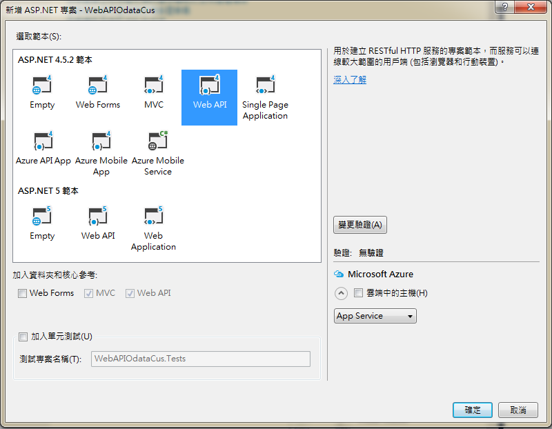
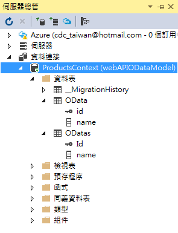
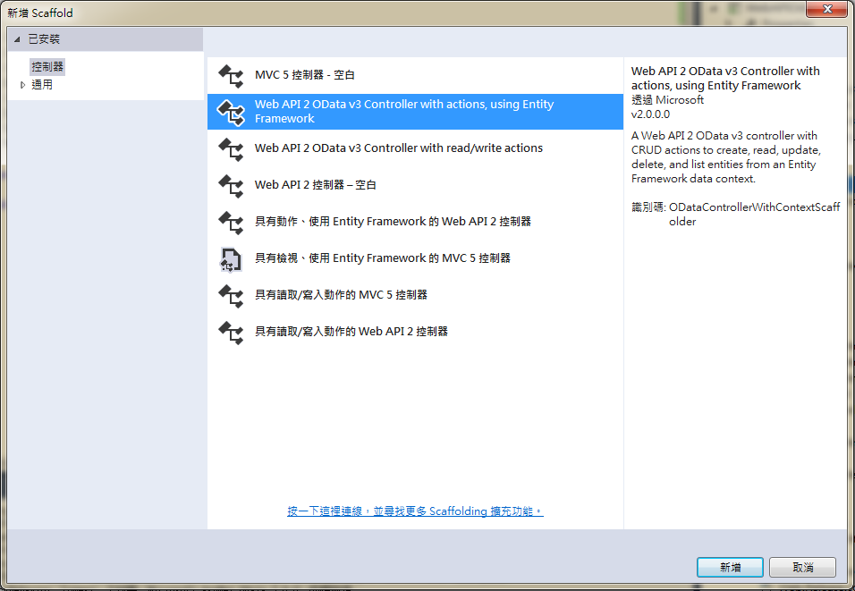
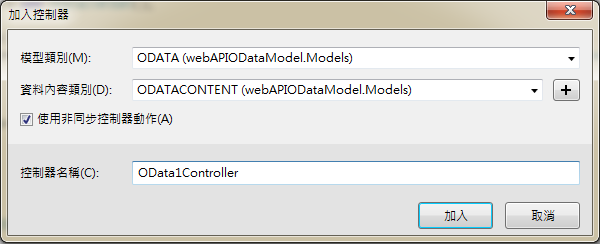
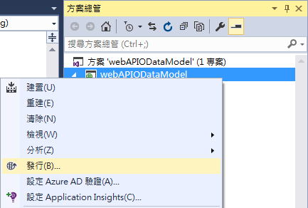
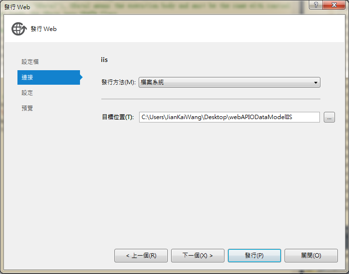
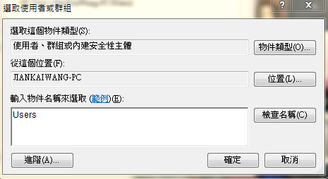
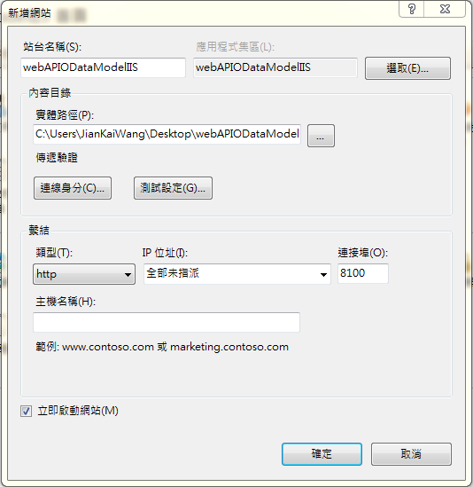
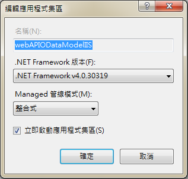

# OData
###採用架構
---
* C#
* ASP.NET 4.5.2
* Web API 2.2
* MVC 5
* OData v4.0
* Web.Odata
* Entity Framework 6
  * Entity Framework (又稱ADO.NET Entity Framework) 是微軟以 ADO.NET 為基礎所發展出來的物件關聯對應 (O/R Mapping) 解決方案，早期被稱為 ObjectSpace，現已經包含在 Visual Studio 2008 Service Pack 1 以及 .NET Framework 3.5 Service Pack 1 以上發表。
  * ADO.NET Entity Framework 以 Entity Data Model (EDM) 為主，將資料邏輯層切分為三塊，分別為 Conceptual Schema, Mapping Schema 與 Storage Schema 三層，其上還有 Entity Client，Object Context 以及 LINQ 可以使用。
  * LINQ (Language Integrated Query)，是一項微軟技術，新增一種自然查詢的 SQL 語法到.NET Framework的程式語言中。
* OData.Edm 6.14.0 (至少 6.5.0 版本以上)

###常用指令
---
| 指令 | 說明 | 範例 |
| -- | -- | -- |
| top | 挑出最前面的幾筆 | 	?$top=3 |
| skip |略過幾筆。可用於分頁顯示 | ?$skip=10 |
| orderby | 排序 | ?$orderby=SupplierID,ProductID |
| filter | 篩選 |  |
|  | gt : > , 大於 | $filter=ProductID gt 10 |
|  | lt : < , 小於 | $filter=ProductID lt 10 |
|  | ge : >=, 大於等於 | $filter=ProductID ge 10 |
|  | le : <=, 小於等於 | $filter=ProductID le 10 |
|  | eq : =, 等於 | $filter=ProductID eq 10<br>$filter=name eq 'f' |
|  | ne : <>, 不等於 | $filter=ProductID ne 10 |

###實作範例
---
#####透過 Web API MVC 連結資料庫中的資料表並實作出 OData RESTful Json 格式介面。

###開始一個 VS 專案
---
* 檔案 > 新增 > 專案 > 範本 > Visual C# > Web > ASP.NET Web 應用程式
* 可以選擇是否採用 MVC 架構 : 本次採用 Web API 範本為例
  * Web API (已加入 MVC 及 Web API 核心參考) > 變更驗證 > 無驗證
  * Empty (至少需勾選 Web API 核心參考)


###安裝所需 Packages
---
* 路徑 : 工具 > NuGet 封裝管理員 > 套件管理器主控台
* 使用 OData Packages : 
```Bash
Install-Package Microsoft.AspNet.Odata
```

* 使用 Web.Odata
```Bash
Install-Package Patches.System.Web.OData -Pre
```

* 使用 OData.Edm
```Bash
Install-Package Microsoft.OData.Edm -Version 6.14.0
```

* 使用 Entity Framework : 
```Bash
Install-Package EntityFramework
```

###使用的 Database 與 Table
---


* 資料庫名為 ProductsContext，包含 two tables，OData 及 ODatas。
* 資料庫為放置在 .\SQLEXPRESS 底下的資料庫，非 App_Data
* OData 內容如下

```Sql
CREATE TABLE [dbo].[OData] (
    [id]   INT           NOT NULL,
    [name] NVARCHAR (50) NOT NULL,
    CONSTRAINT [PK_OData] PRIMARY KEY CLUSTERED ([id] ASC)
);
```

| id | name |
| -- | -- |
| 1 | a |
| 2 | b |
| 3 | c |

* ODatas : 為 SetInitializer 自動產生，內容可以參考下述。

```Sql
CREATE TABLE [dbo].[ODatas] (
    [Id]   INT           NOT NULL,
    [name] NVARCHAR (50) NULL,
    PRIMARY KEY CLUSTERED ([Id] ASC)
);
```

| Id | name |
| -- | -- |
| 1 | a |
| 2 | f |
| 3 | e |
| 4 | 11 |

###加入 Model
---
微軟官網上定義 「A model is an object that represents a data entity in your application.」，指出 model 就是與資料處理個體有關。<br>
* 右鍵點擊 Models 資料夾 > 加入 > 類別 (C# Class) > 取名為 ODATA (ODATA.cs)

| 註解 |
| -- |
| 一般而言，處理資料模型會將 class 放置在 Models folder，但並不強制如此作法。 |

* 加入下方類別成員定義

```csharp
// ODATA is the class used by C#, 
// the member must be the same with columns of the table in database
// [Table("OData")] is used to specify the table already existing
// the name must be the same with table in the database
using System;
using System.Collections.Generic;
using System.ComponentModel.DataAnnotations.Schema;
using System.Data.Entity;
using System.Data.SqlClient;
using System.Linq;
using System.Web;

namespace webAPIODataModel.Models {
    [Table("OData")]
    public class ODATA
    {
        // id is the key
        public int id { get; set; }
        public string name { set; get; }
    }
}
```

* 類別定義說明
  * 此類別的定義主要由 C# 使用
  * 而被定義成員需與資料庫中要使用的 table 的 column 名字相同
  * 其中 [Table("OData")] 用來標示要讀取資料庫中哪一張表，需與繼承 DbContext 的類別中 SetInitializer 共同使用
  *  若是該資料庫中沒有此張表，則不需加上 [Table("OData")]，則 DBSet 會在第一次被要求存取時自動產生一張表，而之後便會利用此張表當作 API 存取對象
  *  其中成員 Id 是搜尋物件的 Key，Clients 可以透過此 Key 進行 Query。舉例而言，要找到物件 Product 中 Id 為 5 的搜尋方式，可以透過 URI 為 /Products(5) 來達成，而 Id 亦是後端資料庫的主要 Key (Primary Key)。 
  *  若是利用 DBSet 於第一次進行表格的創建，則亦可以透過 Seed 方式，先將一部分資料先行存入
```csharp
protected override void Seed(DBContextClass context) { 
    ... 
}
```

###開啟 Entity Framework
---
本次的範例將會使用 Entity Framework (EF) Code 來產生後端資料庫

| 註解 |
| -- |
| Web API Odata 可以不需要 EF，而是可以使用任何能轉換資料庫成資料模型 (models) 的資料鍵階層 (data-access layer) 皆能做為 OData 使用的 entity。 |

* 若是使用 Entity Framework，需要確認已安裝所需 Package (如上述步驟安裝 Entity Framework)
```Bash
Install-Package EntityFramework
```

* 開啟 Web.config 檔案，將下列連接字串加入 Configuration 元素中，在 configSections 元素之後加入。
* 其中 ProductsContext 將在之後被繼承 DbContext 的類別所引用
* .\SQLEXPRESS 為本機使用之 Database server

```Xml
<configuration>
  <configSections>
    <!-- ... -->
  </configSections>

  <!-- Add this: -->
  <connectionStrings>
    <add name="ProductsContext" connectionString="Data Source=.\SQLEXPRESS;Initial Catalog=Product;Persist Security Info=True;User ID=odata;Password=odata" providerName="System.Data.SqlClient" />
  </connectionStrings>
```

* 這項設定透過一連接字串指示要連入本機端 DB (LocalDB)。這資料庫在運行本機 APP 時會被用到。

* 下一步，加入名為 ODATACONTENT 類別，並加入下方類別定義。此類別繼承 DbContext，並於物件創造時便會連接資料庫。 

| 註解 |
| -- |
| 此 ODATACONTENT 類別可以獨立於 Model 資料夾成為 ODATACONTENT.cs，尤其當連接的表格很多時，可獨立成連接資料庫中不同的 Table 的類別，但並不強迫；亦可以直接將連接資料庫的此類別直接寫入與 ODATA class 相同的 namespace 中。  |

```csharp
using System;
using System.Collections.Generic;
using System.ComponentModel.DataAnnotations.Schema;
using System.Data.Entity;
using System.Data.SqlClient;
using System.Linq;
using System.Web;

namespace webAPIODataModel.Models {
    // Use DbContext to load the whole database
    // or load the collection of multiple tables
    public class ODATACONTENT : DbContext {
        // after initializing the object
        // the object directly links the database though connectionString defined in Web.config
        // the format "name=(connection string name)"
        public ODATACONTENT() : base("name=ProductsContext") {
            // condition.1 : existing table
            // if the table already existing in the database, it is not necessary to create a new table in it
            // the SetInitializer load the DbContext and set null to initialization
            Database.SetInitializer<ODATACONTENT>(null);

            // condition.2 : no table
            // But if you created the database yourself, no table in it
            // then you need to specify an initialization strategy otherwise no tables will be added to the database
            // in the most case, the VS might do the thing automatically, the following code would be no need
            //Database.SetInitializer(new DropCreateDatabaseIfModelChanges<ODATACONTENT>());
        }

        // DbSet loads tables in the database and also is the interface to execute CRUD operations
        // <ODATA> is the class defined in C# to map the datatype to the table in the database
        // OData is the "table name" in the database
        public DbSet<ODATA> OData { get; set; }
    }
}
```

* 類別定義說明
  * 其中建構子 ProductsContext() 中定義 base 的 "name=ProductsContext" 需指向 connectionStrings。
  * 繼承 DbContext 目地為載入整個資料庫或者是載入含有多張表的資料集
  * 於物件被產生時，便會直接透過 Web.config 定義的 connectionString 連接至資料庫；而 base("name=ProductsContext") 便是找出在 web.config 中定義名為 ProductsContext 的 connectionString，此 base("name=[連接字串名稱]") 為規定寫法。
  * 若是資料庫中已有需要引用的表，則並不需要再創建一張表，因此 SetInitializer 為 null，而此程式碼需與資料類別定義 [Table("OData")] 一起使用，即
```csharp
Database.SetInitializer<ODATACONTENT>(null);
```

 * 但若是資料庫中沒有此張表，則 visual studio 便會於第一次被呼叫時，將此表自動產生；但若沒有自動產生，則透過透過下方程式碼將之產生。
```csharp
Database.SetInitializer(new DropCreateDatabaseIfModelChanges<ODATACONTENT>());
```

  * DBSet 目地為在入資料庫中的表，並作為 CRUD 的操作介面，其中 &lt;ODATA&gt; 是 C# 中被定義來對應資料表各欄位名稱(包含其資料型態)，而 OData 則是 C# 中表示  DBSet 物件的變數名稱，此可以變動。


###OData Endpoint 的組態設定
---
* 開啟檔案 App_Start/WebApiConfig.cs，加入下方使用的函式庫的程式碼

```csharp
//較不建議使用，因 OData 4.0 版本與現行 OData MVC 3.0 版本有衝突，可能造成  error 406 問題
//using System.Web.OData.Builder;
//using System.Web.OData.Extensions;

using System;
using System.Collections.Generic;
using System.Linq;
using System.Web.Http;
using System.Web.Http.OData.Builder;
using webAPIODataModel.Models;
```

* 加入下方程式碼入 Register method 來註冊路由器
```csharp
public static class WebApiConfig
    {
        public static void Register(HttpConfiguration config)
        {
            // Web API 設定和服務

            // Web API 路由
            config.MapHttpAttributeRoutes();

            // OData setting
            // use ODataConventionModelBuilder to set the entity and model
            ODataConventionModelBuilder builder = new ODataConventionModelBuilder();

            // builder.EntitySet must be the same with data model definition
            // <ODATA> is the class defined by C# to map tables in database
            // EntitySet<ODATA>("OData1"), OData1 means the execution body and must be the same with controller's name
            // EntitySet loads the OData into ODATA Class
            // Because OData v3 (Controller) is not compatible with OData v4 (Web API)
            // config.MapODataServiceRoute might cause 406 (Not Acceptable), so config.Routes.MapODataRoute might be better
            builder.EntitySet<ODATA>("OData1");
            config.Routes.MapODataRoute(
                routeName: "ODataRoute",
                routePrefix: "ODataPrefix",
                model: builder.GetEdmModel()
            );

            // general routing
            config.Routes.MapHttpRoute(
                name: "DefaultApi",
                routeTemplate: "api/{controller}/{id}",
                defaults: new { id = RouteParameter.Optional }
            );
        }
    }
```

* 此 Code 作了下列兩件事
  * 創造出 Entity Data Model (EDM) :
EDM 是資料模型的摘要 (abstract model of the data)，被用來產生此服務的中介資料內容 (metadata document)。類別 ODataConventionModelBuilder 可以透過預設命名轉換創造出一個 EDM。此方法可以省略很多步驟，程式碼相對少很多。而若是希望能對 EDM 有更多的控制，則可以使用 ODataModelBuilder 類別來達成，其可以透過加入特性 (properties)、索引 (Keys) 及導覽開放成員特性 (navigation properties explicitly) 等。
  
  * 加入一個路由器 (可以給瀏覽器或是其他連結此網路資源的介面使用) :
route 路由器告訴 Web API 如何導引 HTTP 請求 (request) 到各自的 Endpoint。若是要在 OData v4.0 下創立一個路由，可以呼叫 config.Routes.MapODataRoute 延伸方法來達成。<br>
此外，若是一個 Web API 有多個 OData endpoint，則可以透過給不同的路由器名稱 (routeName) 及路徑前綴 (routePrefix) 來設定路由器以便對應不同的 API。

* 路由器定義
  * builder.EntitySet 中使用的類別定義需與 Models 定義之類別名稱相同，而控制器名稱需與控制器前綴名稱 ([控制器名稱]Controller.cs) 相同 
```csharp
builder.EntitySet<資料表類別，本例為 ODATA>("控制器名稱，本例為 OData1")
```

  * routePrefix 則是定義 CRUD 導入的網址路由路徑，本例而言即為
```html
http://localhost:port/ODataPrefix/{controller name}/{OData operations}
```

###加入一個 OData 控制器 (Controller)
---
微軟官網上說明「A controller is a class that handles HTTP requests.」，Controller 便是一個資料處理者。一個 OData 服務可以透過不同的 Controller 來處理不同的 Data Entity Set。<br>
本次的範例中，可以創造一個 Controller 來處理 Product entity set。

* 建議於加入 controller 時，先 rebuild 專案以取得先前 Model 的設置，則可以點擊 「建置」 > 「重建方案」來達成。

* 右鍵點擊 Controllers 資料夾 > 加入 > 控制器 > Web API 2 OData v3 Controller with action, using Entity Framework

因本次範例使用 Entity Framework，且目前最新 OData v3 使用 Add Controller scaffolding (尚無 scaffolding for OData v4)。但這會與 OData v4 版本衝突，需要調整路由器的註冊選單 (App_Start/WebApiConfig.cs)。

* 模型類別 > 選擇剛已建置的資料模型「Product (WebAPIOData.Models)」，其中 WebAPIOData 為本專案名稱 > 資料內容類別 > 選擇剛已建立的類別「ProductsContext (WebAPIOData.Models)」

* 勾選使用非同步控制器動作 (不需每次運作都要去重取完整 Data Model，尤其背後若有大型資料庫更是如此) > 控制器名稱 > 建議使用預設 (否則需符合 [自命名]Controller 的格式)

* 控制器的命名需和路由器註冊的設定名稱相同
```csharp
builder.EntitySet<ODATA>("OData1");
```


* 若是 Visual Studio 提示錯誤，需要 rebuild 專案，則可以點擊 「建置」 > 「重建方案」，讓開發環境重新取得先前 Model 的設置。

* 將下列程式模板加入此 OData1Controller.cs 中

```csharp
using System.Data;
using System.Data.Entity;
using System.Data.Entity.Infrastructure;
using System.Data.SqlClient;
using System.Linq;
using System.Net;
using System.Net.Http;
using System.Threading.Tasks;
using System.Web.Http;
using System.Web.Http.ModelBinding;
using System.Web.Http.OData;
using System.Web.Http.OData.Routing;
using webAPIODataModel.Models;

namespace webAPIODataModel.Controllers
{
    /*
    WebApiConfig 類別可能需要其他變更以新增此控制器的路由，請將這些陳述式合併到 WebApiConfig 類別的 Register 方法。注意 OData URL 有區分大小寫。
    預設即有部分程式碼供導引如下;
    using System.Web.Http.OData.Builder;
    using System.Web.Http.OData.Extensions;
    using webAPIODataModel.Models;
    ODataConventionModelBuilder builder = new ODataConventionModelBuilder();
    builder.EntitySet<ODATA>("ODATAs");
    config.Routes.MapODataServiceRoute("odata", "odata", builder.GetEdmModel());
    */
    public class OData1Controller : System.Web.Http.OData.ODataController
    {
        private ODATACONTENT db = new ODATACONTENT();
        
        protected override void Dispose(bool disposing)
        {
            if (disposing)
            {
                db.Dispose();
            }
            base.Dispose(disposing);
        }

        private bool ODATAExists(int key)
        {
            return db.OData.Count(e => e.id == key) > 0;
        }
    }
}
```
此控制器 OData1Controller 使用 ODATACONTENT 類別來存取使用 EF 框架的資料庫。注意此控制器 overrides 其中的 Dispose method 來處理 ODATACONTENT。<br>
而這是此控制器的起始點，下一步便會增加 CRUD 的操作模式。

###查詢 Entity Set (Querying the Entity Set)
---
* 加入下方的類別方法入 OData1Controller (OData1Controller.cs) 中

```csharp
[EnableQuery]
public IQueryable<ODATA> Get()
{
    return db.OData;
}

[EnableQuery]
public SingleResult<ODATA> Get([FromODataUri] int key)
{
    return SingleResult.Create(db.OData.Where(oDATA => oDATA.id == key));
}
```

  * 沒有參數版本的 Get Method 回傳完整的 Products 物件集合。<br>
而含有一個 key 參數的 Get Method 則透過此 Key 查詢 Product 物件，此例子是利用 Id 特性 (property)。
  * 屬性 [EnableQuery] 允許 CLients 來修正搜尋，透過搜尋選項如 $filter, $sort, 及 $page 等。若要搜尋更多的資訊，可以參考 [Supporting OData Query Options](http://www.asp.net/web-api/overview/odata-support-in-aspnet-web-api/supporting-odata-query-options)。

###加入一項資料體入資料體 (Adding an Entity to the Entity Set)
---
* 若要能允許使用者將一個新物件 Product 加入資料庫中，可以加入底下方法入 OData1Controller (OData1Controller.cs) 中
```csharp
public async Task<IHttpActionResult> Post(Product product)
{
    if (!ModelState.IsValid)
    {
        return BadRequest(ModelState);
    }
    db.Products.Add(product);
    await db.SaveChangesAsync();
    return Created(product);
}
```

###更新資料體 (Updating an Entity)
---
* OData 支援兩種不同的語法來更新資料體，即 PATCH 與 PUT。

  * PATCH 執行 partial update，使用者透過標示特性的方式來針對資料進行更新。(The client specifies just the properties to update.)
  
  * PUT 則是更新整個資料體。PUT 缺點為使用者必須傳送資料體中所有的特性，包含沒有要更新的值。因此 OData 規則中比較建議使用 PATCH。

* 底下為 async 的 PATCH 實作方式
```csharp
public async Task<IHttpActionResult> Patch([FromODataUri] int key, Delta<Product> product)
{
    if (!ModelState.IsValid)
    {
        return BadRequest(ModelState);
    }
    var entity = await db.Products.FindAsync(key);
    if (entity == null)
    {
        return NotFound();
    }
    product.Patch(entity);
    try
    {
        await db.SaveChangesAsync();
    }
    catch (DbUpdateConcurrencyException)
    {
        if (!ProductExists(key))
        {
            return NotFound();
        }
        else
        {
            throw;
        }
    }
    return Updated(entity);
}
```

* 底下為 async 的 PUT 實作方法
```csharp
public async Task<IHttpActionResult> Put([FromODataUri] int key, Product update)
{
    if (!ModelState.IsValid)
    {
        return BadRequest(ModelState);
    }
    if (key != update.Id)
    {
        return BadRequest();
    }
    db.Entry(update).State = EntityState.Modified;
    try
    {
        await db.SaveChangesAsync();
    }
    catch (DbUpdateConcurrencyException)
    {
        if (!ProductExists(key))
        {
            return NotFound();
        }
        else
        {
            throw;
        }
    }
    return Updated(update);
}
```
在 PATCH 方法中，控制器使用 Delta<T> 方法來追蹤改變的值。

###刪除一個資料 (Deleting an Entity)
---
* 若要使用者能夠從資料庫中刪除一筆資料 (delete a product from the database)，可以加入底下方法入 ProductsController (ProductsController.cs) 中
```csharp
public async Task<IHttpActionResult> Delete([FromODataUri] int key)
{
    var product = await db.Products.FindAsync(key);
    if (product == null)
    {
        return NotFound();
    }
    db.Products.Remove(product);
    await db.SaveChangesAsync();
    return StatusCode(HttpStatusCode.NoContent);
}
```

###佈署至 IIS Server (7.5 為例)
---
* 以發行方式進行將 Web API 匯出
  * 「方案總管」 > 對專案點右鍵 (WebAPIODataModel) > 發行



  * 設定檔 「自訂」 > 輸入一個設定檔名稱 > "下一步" > iis 的發行方法 > 「檔案系統」 > 目標位置 「(選擇要放置的路徑，此路徑之後會給 IIS 建立網站使用，舉放置在桌面的 webAPIODataModelIIS 資料夾為例)」> "下一步"



  * 設定 > 組態「Release」> "下一步" > "發行"

  * 因為 Web API 發行檔多為開放於網路空間，但發行後的 Web API 內容預設並非給公開使用，因此需先增加一個使用權限，便能透過 IIS 進行架設。對剛發行完版本的資料夾點擊右鍵 > 「內容」 > 「安全性」 > 「編輯」 > 「新增」 > 輸入物件名稱來選取 「Users」 > 「確定」 > SYSTEM 的權限 (此部分需視此 API 的用途，是否具被寫入等功能) 來決定 > 「確定」 > 即可。



  * 開啟 IIS

| 註解 |
| -- |
| 需要注意 IIS 需要先開啟 ASP, ASP.NET 功能。若沒有開啟，可以從控制台 > 開啟或關閉 Windows 功能 > Internet Information Services > World Wide Web 服務 > 應用程式開發功能，點擊 .NET 擴充性, ASP, ASP.NET，然後點選確定來開啟。 |

  * 右鍵點擊「站台」 > 「新增網站」 > 寫入「站台名稱」 > 指定「實體路徑」 > 繫結 > 連接埠 「8100」 (此可以自行調整)



  * 因為此資料夾在網路上為一階層，因此需要開啟「瀏覽目錄」的功能，在點擊此新網站後，選擇 IIS > 雙點擊「瀏覽目錄」 > 於右側的「動作」中 > 「開啟」即可。

  * 最後因為本 Web API 已經使用 .NET Framework 4.0 版本，故於「應用程式集區」下，選擇 「webAPIODataModelIIS」，並在 .NET Framework 版本選擇「.NET Framework v4.0.30319」。



###使用方式
---
* 來自 HTTP 的 Request
  * OData Web API
```html
http://localhost:1495/ODataPrefix/    <!--測試機-->
http://192.168.1.24:8100/ODataPrefix/    <!--IIS 下-->
```

  * 取得 metadata
```html
http://localhost:1495/ODataPrefix/$metadata    <!--測試機-->
http://192.168.1.24:8100/ODataPrefix/$metadata    <!--IIS 下-->
```

  * 取出前 3 例
```html
http://localhost:1495/ODataPrefix/OData1(3)    <!--測試機-->
http://localhost:1495/ODataPrefix/OData1/?$top=3    <!--測試機-->
http://192.168.1.24:8100/ODataPrefix/OData1(3)    <!--IIS 下-->
http://192.168.1.24:8100/ODataPrefix/OData1/?$top=3    <!--IIS 下-->
```

  * 取出 name 為 f 的該筆資料
```html
http://localhost:1495/ODataPrefix/OData1/?$filter=name eq 'f'    <!--測試機-->
http://192.168.1.24:8100/ODataPrefix/OData1/?$filter=name eq 'f'    <!--IIS 下-->
```


