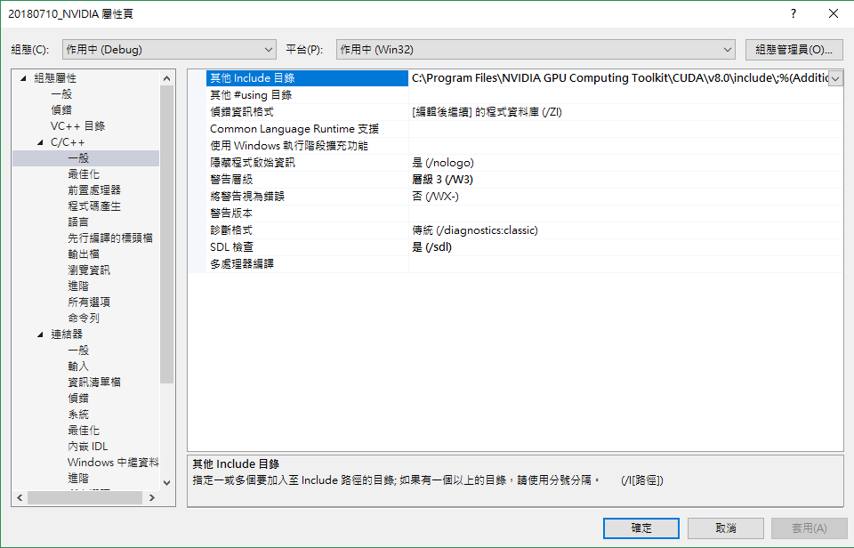

# Quick Start


* Reference:
  * http://www.kimicat.com/opencl-1/opencl-jiao-xue-yi


## Windows


### NVIDIA

While you have installed NVIDIA graphic card drivers, the OpenCL related headers and libraries has also been installed. You can compile the OpenCL code by adding both paths of  header`Include` and Linking `lib`. The following is the C++ example in Visual Studio 2017.


* OpenCL path in NVIDIA drivers
  * header `include`: `C:\Program Files\NVIDIA GPU Computing Toolkit\CUDA\v8.0\include\`. There must exist `CL/cl.h`.
  * Linkging `lib`: `C:\Program Files\NVIDIA GPU Computing Toolkit\CUDA\v8.0\lib\Win32`. There must exist `OpenCL.lib`.


* In `Visual Studio 2017`, right-click the project and select the `properties`.

  * under `C/C++`, add `include` path to `Additional Include Directories`.

  

  * under `Linker`, add `lib` path to `Additional Library`.

  


## Example Code


The following is the quick example for finding devices over OpenCL on NVIDIA in Windows.


```c++
#include <iostream>
#include <cstdlib>
#include <vector>
#include <string>

#ifdef __APPLE__
#include <OpenCL/opencl.h>
#else
#include <CL/cl.h>
#endif

using namespace std;

int main(int argv, char* args[]) {
	cout << "Hello world, OpenCL!" << endl;

	// count pltforms
	cl_int err;
	cl_uint num;
	err = clGetPlatformIDs(0, 0, &num);
	if (err != CL_SUCCESS) {
		cerr << "Unable to get platforms" << endl;
		return 0;
	} 
	else {
		cout << num << endl;
	}

	// get platform IDs
	vector<cl_platform_id> platforms(num);
	err = clGetPlatformIDs(num, &platforms[0], &num);
	if (err != CL_SUCCESS) {
		cerr << "Unable to get platform ID" << endl;
		return 0;
	}
	else {
		// list all platform ID
		for (int i = 0; i < num; i++) {
			cout << platforms[i] << "\t";
		}
		cout << endl;
	}

	// create the OpenCL context, clCreateContextFromType()
	// clCreateContextFromType(property of context, device_type, ...)
	// device_type
	// |- CL_DEVICE_TYPE_CPU：使用 CPU 裝置
	// |- CL_DEVICE_TYPE_GPU：使用顯示晶片裝置
	// |- CL_DEVICE_TYPE_ACCELERATOR：特定的 OpenCL 加速裝置，例如 CELL
	// |- CL_DEVICE_TYPE_DEFAULT：系統預設的 OpenCL 裝置
	// |- CL_DEVICE_TYPE_ALL：所有系統中的 OpenCL 裝置
	cl_context_properties prop[] = { CL_CONTEXT_PLATFORM, reinterpret_cast<cl_context_properties>(platforms[0]), 0 };
	cl_context context = clCreateContextFromType(prop, CL_DEVICE_TYPE_DEFAULT, NULL, NULL, NULL);
	if (context == 0) {
		cerr << "Can't create OpenCL context\n";
		return 0;
	}

	// get the device list, clGetContextInfo()
	// first is to get the memory size for saving the device list
	size_t cb;
	clGetContextInfo(context, CL_CONTEXT_DEVICES, 0, NULL, &cb);

	// listing all devices 
	vector<cl_device_id> devices(cb / sizeof(cl_device_id));
	clGetContextInfo(context, CL_CONTEXT_DEVICES, cb, &devices[0], 0);

	// get device name
	clGetDeviceInfo(devices[0], CL_DEVICE_NAME, 0, NULL, &cb);
	string devname;
	devname.resize(cb);
	clGetDeviceInfo(devices[0], CL_DEVICE_NAME, cb, &devname[0], 0);
	std::cout << "Device: " << devname.c_str() << "\n";

	clReleaseContext(context);

	system("PAUSE");
	return 0;
}
```

